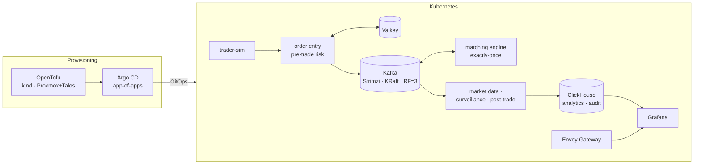

# kafka-financial-event-platform

A stock-exchange event platform on Kubernetes, built to process **one billion
events end-to-end** with finance-grade governance, operability and resilience.

The focus is day-2 operation, not just a working demo. That covers policy and audit,
retention, upgrades, maintenance, and high availability / disaster recovery. Each of
these is designed as code and documented.

> **Status:** Phase 0 (foundation) complete; Phase 1 (cluster) next. See the [roadmap](#roadmap).

## Highlights

- **Portable by design.** Only one layer knows the infrastructure. The same platform
  runs on local kind today and is designed for Proxmox + Talos on-prem.
- **Everything is a provisioned state.** Any environment can be rebuilt from this
  repository with OpenTofu and GitOps. Nothing is built by hand.
- **Profiles instead of one big cluster.** A small `dev` profile runs daily. The `perf`
  (billion-event run) and `dr` (secondary site) profiles are provisioned on demand,
  exercised, measured, and torn down.
- **A real, deterministic matching engine.** Price-time priority on a MiFID II-style market.
  Replaying the order log rebuilds the exact same order book, so replay serves both as a
  correctness test and as a recovery path.
- **Finance semantics.** Exactly-once processing, idempotency, replication factor 3 with
  `min.insync.replicas=2`, and a tamper-evident audit trail.
- **Governance as a first-class concern.** A control matrix maps each control to
  EU regulatory references (MiFID II/MiFIR, MAR, DORA, GDPR) and ISO 27001 and records its evidence.

## Topology



More detail: [docs/architecture.md](docs/architecture.md).

## Technology decisions

Each choice has an Architecture Decision Record. The ADR lists the alternatives that
were considered and the trade-offs.

| Area | Choice | Why | ADR |
|---|---|---|---|
| Market model | MiFID II-style regulated equity market | Public, international rulebook; trading phases give maintenance windows | [0021](docs/adr/0021-model-a-mifid-style-regulated-equity-market.md) |
| Matching engine | Deterministic price-time engine on Kafka | Real order book; replay doubles as recovery | [0022](docs/adr/0022-build-a-deterministic-price-time-matching-engine.md) |
| Scope | "1B" = cumulative, end-to-end throughput | Measurable; fits a ~76 GB disk budget | [0002](docs/adr/0002-define-billion-as-cumulative-throughput.md) |
| Provisioning model | 3 layers + `dev` / `perf` / `dr` profiles | Portable; heavy scenarios exist as code without running daily | [0003](docs/adr/0003-layered-portable-provisioning.md) |
| Local substrate | kind (1 control-plane + 1 worker in `dev`) | Upstream Kubernetes, multi-node, IaC-friendly | [0004](docs/adr/0004-use-kind-for-local-substrate.md) |
| On-prem substrate | Proxmox VE + Talos Linux | Bank-like on-prem target; immutable, declarative OS | [0005](docs/adr/0005-design-proxmox-talos-as-second-substrate.md) |
| Infrastructure as code | OpenTofu | Open-source (MPL-2.0); Terraform is now BUSL | [0006](docs/adr/0006-use-opentofu-for-infrastructure-as-code.md) |
| GitOps | Argo CD, app-of-apps | Drift detection, self-heal, auditable changes | [0007](docs/adr/0007-use-argo-cd-for-gitops.md) |
| Event backbone | Apache Kafka on Strimzi, KRaft | Declarative topics, users and ACLs; rolling upgrades | [0008](docs/adr/0008-run-kafka-with-strimzi-in-kraft-mode.md) |
| Services | Go + franz-go | Pure Go, transactions (EOS), high throughput | [0009](docs/adr/0009-write-services-in-go-with-franz-go.md) |
| Analytical sink | ClickHouse (Altinity operator) | High ingest, compression, append-only audit | [0010](docs/adr/0010-use-clickhouse-as-analytical-sink.md) |
| Cache / dedup | Valkey | Redis-compatible, BSD-licensed | [0011](docs/adr/0011-use-valkey-for-dedup-and-cache.md) |
| Schema registry | Apicurio Registry | Open source; enforces compatibility rules | [0012](docs/adr/0012-use-apicurio-as-schema-registry.md) |
| Policy | Kyverno | Policies as Kubernetes YAML; testable offline | [0013](docs/adr/0013-use-kyverno-for-policy-as-code.md) |
| Traffic | Gateway API + Envoy Gateway | Successor to Ingress; same manifests on every substrate | [0014](docs/adr/0014-expose-services-with-gateway-api.md) |
| Observability | kube-prometheus-stack | Standard stack; Strimzi metrics built in | [0015](docs/adr/0015-use-kube-prometheus-stack-for-observability.md) |
| Kafka UI | Kafbat UI | Open-source; schema and ACL aware | [0016](docs/adr/0016-use-kafbat-ui-for-kafka-inspection.md) |
| Testing | Unit/integration · manifest/policy · load · chaos | Evidence at every layer | [0017](docs/adr/0017-test-at-four-layers.md) |
| CI | GitHub Actions | Native to the repository host; reuses local `task` targets | [0018](docs/adr/0018-use-github-actions-for-ci.md) |
| Governance | Regulations as reference frameworks | Controls are traceable, with no false compliance claims | [0019](docs/adr/0019-treat-regulations-as-reference-frameworks.md) |
| Repo hygiene | pre-commit, gitleaks, Conventional Commits, Task | No leaked secrets; readable, attributable history | [0020](docs/adr/0020-enforce-repository-hygiene-with-pre-commit.md) |

Full index: [docs/adr/](docs/adr/README.md).

## Environments and profiles

| Profile | Purpose | Size | Runs |
|---|---|---|---|
| `dev` | Daily development and HA drills | 2 nodes, 3 small Kafka pods | Routinely |
| `perf` | Billion-event run and tuning | Sized for throughput | On demand |
| `dr` | Secondary site for DR drills | Mirrors primary | On demand |

| Substrate | Status |
|---|---|
| kind (local, Docker) | Primary, Phase 1 |
| Proxmox VE + Talos | Designed as code, run on demand |

## Roadmap

| # | Phase | Scope | Status |
|---|---|---|---|
| 0 | Foundation | Repo hygiene, docs skeleton, ADRs, control matrix, CI | ✅ complete |
| 1 | Cluster | Layered OpenTofu, kind, Argo CD bootstrap, profiles | ⚪ planned |
| 2 | Platform | Monitoring, logging and retention, Kyverno, Envoy Gateway, cert-manager, secrets | ⚪ planned |
| 3 | Kafka | Strimzi KRaft, TLS + SCRAM, ACLs, topics as code, Apicurio, Kafbat UI | ⚪ planned |
| 4 | Apps | trader-sim, order entry, matching engine (EOS), market data, surveillance, post-trade, ClickHouse, Valkey | ⚪ planned |
| 5 | Tests | Unit/integration, manifest/policy, load, chaos | ⚪ planned |
| 6 | Billion run | Tuning, 1B run, benchmark report, dashboards | ⚪ planned |
| 7 | Resilience | HA scenarios, backup/restore, DR drills with measured RPO/RTO | ⚪ planned |
| 8 | Lifecycle | Upgrade scenarios, maintenance plans, rollback | ⚪ planned |
| + | CI | Lint and secret scan ✅; tests, manifest and policy validation per phase | 🟡 ongoing |
| + | Governance | Control matrix updated every phase | 🟡 ongoing |

## Documentation

| Path | Contents |
|---|---|
| [docs/architecture.md](docs/architecture.md) | Layers, data flow, components, profiles |
| [docs/adr/](docs/adr/README.md) | Architecture Decision Records |
| [docs/compliance/](docs/compliance/README.md) | Governance approach and control matrix |
| [docs/dr/](docs/dr/README.md) | HA/DR scenario catalogue and drill reports |
| [docs/operations/](docs/operations/README.md) | Upgrade paths and maintenance plans |
| [docs/runbooks/](docs/runbooks/README.md) | Operational procedures |
| [docs/benchmarks/](docs/benchmarks/README.md) | Benchmark method and results |

## Getting started

Requirements: Docker, kind, kubectl, Helm, OpenTofu, Task, pre-commit, gitleaks.

```sh
task tools:check   # verify required CLIs
task setup         # install git hooks
task lint          # run all checks
```

Cluster provisioning arrives in Phase 1.

## Disclaimer

This is a learning and portfolio platform using synthetic data. It is not certified
against any regulation. Controls are *inspired by* and *mapped to* the cited frameworks.

## License

[Apache-2.0](LICENSE)
