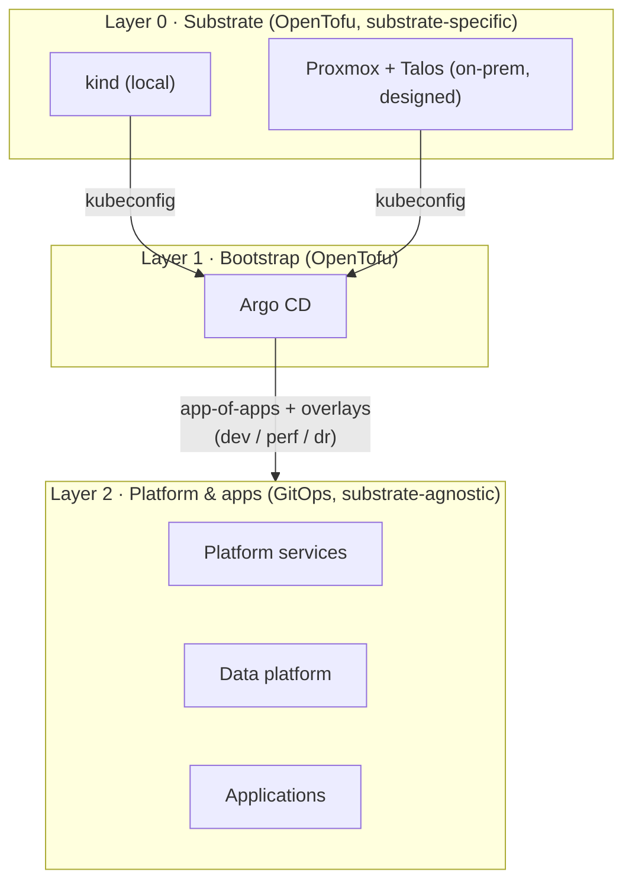
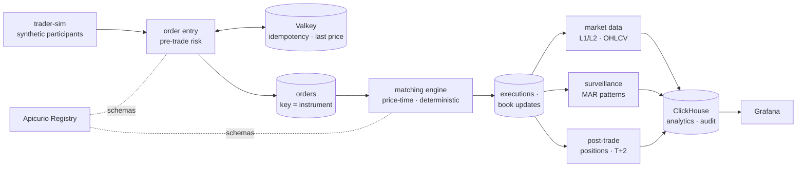

# Architecture

Status: design baseline (Phase 0). Sections are filled in as phases land.

## Provisioning layers

See [ADR 0003](adr/0003-layered-portable-provisioning.md).

## Data flow

Market model: [ADR 0021](adr/0021-model-a-mifid-style-regulated-equity-market.md) ·
Matching engine: [ADR 0022](adr/0022-build-a-deterministic-price-time-matching-engine.md).
Service boundaries are finalised in Phase 4.

## Components

Namespaces are planned and confirmed in the phase that introduces each component.

| Component | Purpose | Namespace | Config path | ADR |
|---|---|---|---|---|
| SeaweedFS | OpenTofu state store, outside the clusters | Docker (host) | `infra/stacks/foundation/` | [0025](adr/0025-store-iac-state-in-out-of-cluster-seaweedfs.md) |
| cloud-provider-kind | LoadBalancer services for kind | Docker (host) | `infra/stacks/substrate-kind-shared/` | [0014](adr/0014-expose-services-with-gateway-api.md) |
| Cilium | CNI, NetworkPolicy, Hubble | `kube-system` | `gitops/platform/cilium/` | [0028](adr/0028-use-cilium-as-cni-with-bootstrap-and-adopt.md) |
| Argo CD | GitOps controller (self-managed) | `argocd` | `gitops/platform/argocd/`, `gitops/root/` | [0030](adr/0030-generate-applications-with-applicationsets.md) |
| Strimzi + Kafka | Event backbone | `kafka` | _Phase 3_ | [0008](adr/0008-run-kafka-with-strimzi-in-kraft-mode.md) |
| Apicurio Registry | Schema registry | `kafka` | _Phase 3_ | [0012](adr/0012-use-apicurio-as-schema-registry.md) |
| Kafbat UI | Kafka inspection | `kafka` | _Phase 3_ | [0016](adr/0016-use-kafbat-ui-for-kafka-inspection.md) |
| trader-sim | Synthetic market participants (load) | `apps` | _Phase 4_ | [0009](adr/0009-write-services-in-go-with-franz-go.md) |
| order entry | Validation, pre-trade risk (tick size, price corridors) | `apps` | _Phase 4_ | [0021](adr/0021-model-a-mifid-style-regulated-equity-market.md) |
| matching engine | Price-time order book, exactly-once | `apps` | _Phase 4_ | [0022](adr/0022-build-a-deterministic-price-time-matching-engine.md) |
| market data / surveillance / post-trade | Downstream consumers of executions | `apps` | _Phase 4_ | [0022](adr/0022-build-a-deterministic-price-time-matching-engine.md) |
| ClickHouse | Analytical sink and audit store | `clickhouse` | _Phase 4_ | [0010](adr/0010-use-clickhouse-as-analytical-sink.md) |
| Valkey | Dedup + cache | `apps` | _Phase 4_ | [0011](adr/0011-use-valkey-for-dedup-and-cache.md) |
| cert-manager | Certificates from the lab intermediate CA | `cert-manager` | `gitops/platform/cert-manager/` | [0035](adr/0035-terminate-tls-at-a-single-gateway-with-a-lab-pki.md) |
| Envoy Gateway + platform gateway | Single TLS entry point, `*.kfep.localhost` | `envoy-gateway-system` | `gitops/platform/envoy-gateway/`, `gitops/platform/gateway/` | [0014](adr/0014-expose-services-with-gateway-api.md), [0035](adr/0035-terminate-tls-at-a-single-gateway-with-a-lab-pki.md) |
| Lab PKI | Root CA (outside clusters), per-profile intermediates | OpenTofu state | `infra/stacks/pki/` | [0035](adr/0035-terminate-tls-at-a-single-gateway-with-a-lab-pki.md) |
| Kyverno | Admission policies | `kyverno` | _Phase 2_ | [0013](adr/0013-use-kyverno-for-policy-as-code.md) |
| kube-prometheus-stack | Metrics, alerts, dashboards (Grafana via the gateway) | `monitoring` | `gitops/platform/monitoring/` | [0015](adr/0015-use-kube-prometheus-stack-for-observability.md), [0037](adr/0037-measure-and-bound-the-platform-with-kube-prometheus-stack.md) |

## Profiles

| Profile | Nodes | Kafka | Lifecycle |
|---|---|---|---|
| `dev` | 1 control-plane + 1 worker | 3 combined pods, RF=3, min ISR=2 | Daily |
| `perf` | Sized for the billion-event run | Dedicated controller and broker pools | On demand |
| `dr` | Secondary site | Replica of primary | On demand, for drills |

## Delivery semantics

- Producers: `acks=all`, idempotence on.
- Order entry: idempotency keys in Valkey reject resubmitted orders.
- Matching: Kafka transactions (read-process-write), one engine loop per partition,
  deterministic replay from the order log.
- Proof: end-to-end reconciliation (produced = processed = stored), see
  [benchmarks](benchmarks/README.md).
